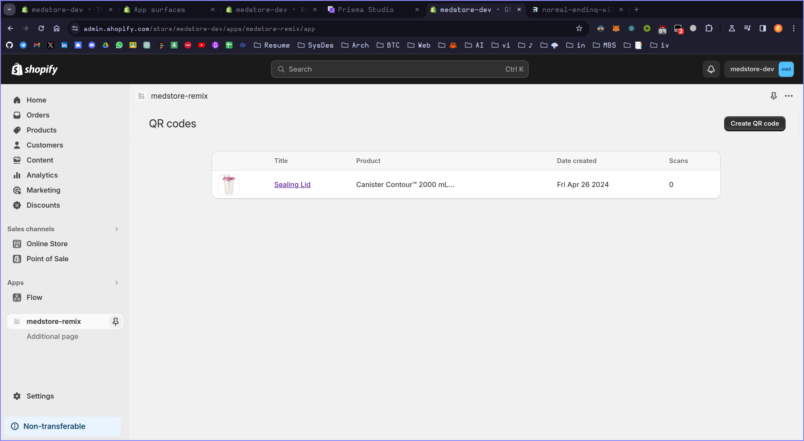
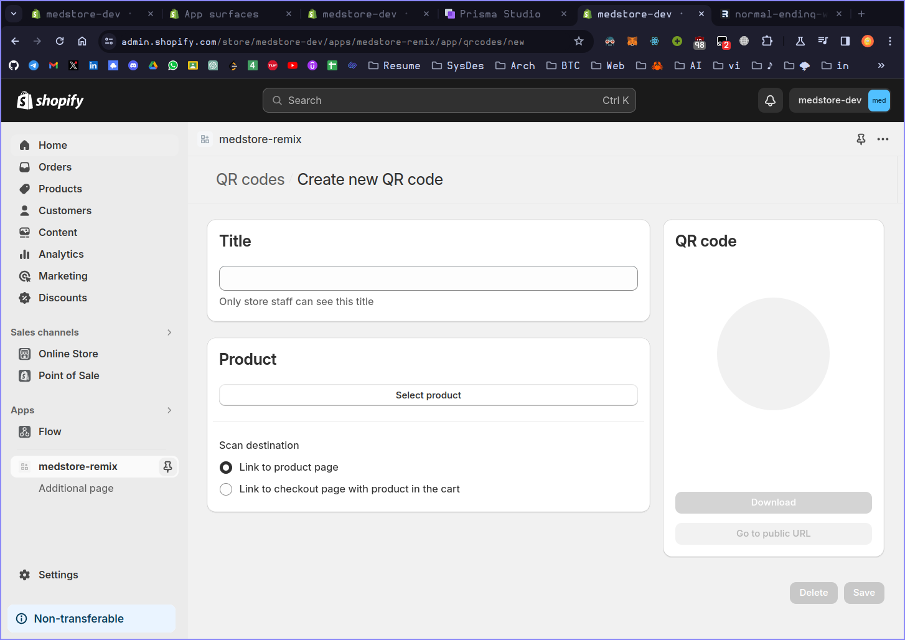
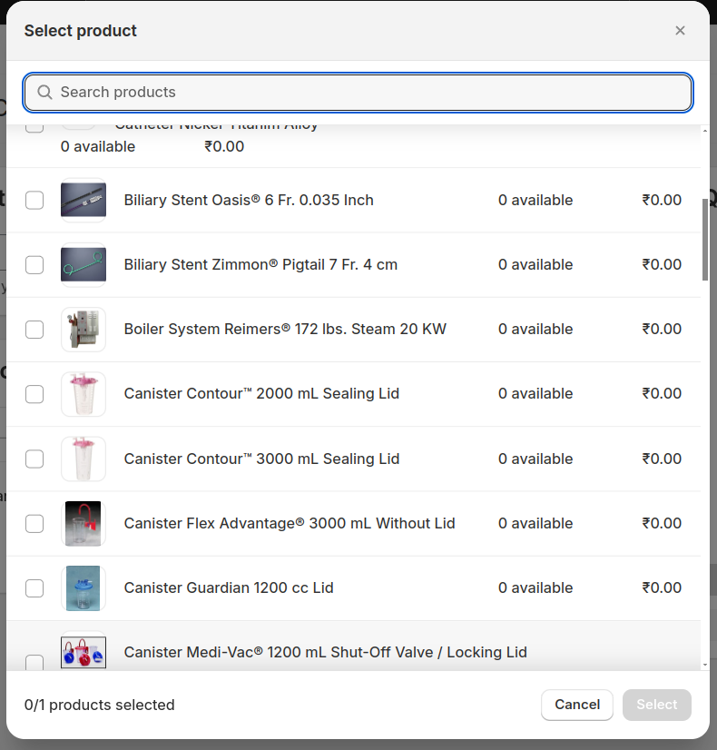
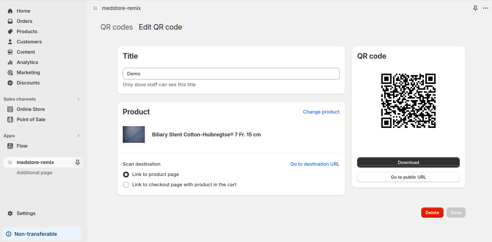
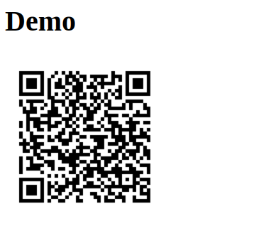
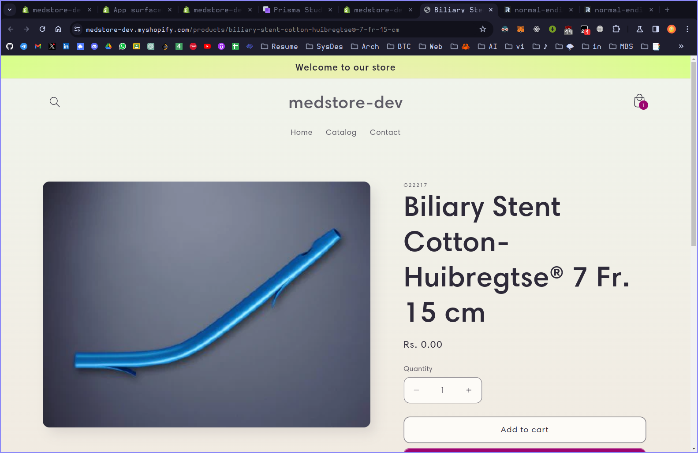

# Medstore-Remix

This is the demo app using the fullstack framework [Remix](https://remix.run).

## Quick start

### Prerequisites

Before you begin, you'll need the following:

1. **Node.js**: [Download and install](https://nodejs.org/en/download/) it if you haven't already.
2. **Shopify Partner Account**: [Create an account](https://partners.shopify.com/signup) if you don't have one.
3. **Test Store**: Set up either a [development store](https://help.shopify.com/en/partners/dashboard/development-stores#create-a-development-store) or a [Shopify Plus sandbox store](https://help.shopify.com/en/partners/dashboard/managing-stores/plus-sandbox-store) for testing your app.

### Setup

If you used the CLI to create the template, you can skip this section.

Using yarn:

```shell
yarn install
```

Using npm:

```shell
npm install
```

Using pnpm:

```shell
pnpm install
```


### Local Development

Using yarn:

```shell
yarn dev
```

Using npm:

```shell
npm run dev
```

Using pnpm:

```shell
pnpm run dev
```

Press P to open the URL to your app. Once you click install, you can start development.

Local development is powered by [the Shopify CLI](https://shopify.dev/docs/apps/tools/cli). It logs into your partners account, connects to an app, provides environment variables, updates remote config, creates a tunnel and provides commands to generate extensions.

## Deployment

### Application Storage

This app uses [Prisma](https://www.prisma.io/) to store session data, by default using an [SQLite](https://www.sqlite.org/index.html) database.
The database is defined as a Prisma schema in `prisma/schema.prisma`.


### Build

Remix handles building the app for you, by running the command below with the package manager of your choice:

Using yarn:

```shell
yarn build
```

Using npm:

```shell
npm run build
```

Using pnpm:

```shell
pnpm run build
```

## Screenshots

- This is how the embedded app looks like
  
- The app generates a qr code for the products
  
- We can select multiple products imported from the store
  
- QR code can be generated, and looks like this:
  
- We get to download the QR code, that we can use with the store
  
- The store can be seen here, which is built using Shopify:
  - [Link](https://medstore-dev.myshopify.com/)
- 


## Tech Stack

The following Shopify tools are also included along with Remix to ease app development:

- [Shopify App Remix](https://shopify.dev/docs/api/shopify-app-remix) provides authentication and methods for interacting with Shopify APIs.
- [Shopify App Bridge](https://shopify.dev/docs/apps/tools/app-bridge) allows your app to seamlessly integrate your app within Shopify's Admin.
- [Polaris React](https://polaris.shopify.com/) is a powerful design system and component library that helps developers build high quality, consistent experiences for Shopify merchants.
- [Webhooks](https://github.com/Shopify/shopify-app-js/tree/main/packages/shopify-app-remix#authenticating-webhook-requests): Callbacks sent by Shopify when certain events occur
- [Polaris](https://polaris.shopify.com/): Design system that enables apps to create Shopify-like experiences

## Resources

- [Remix Docs](https://remix.run/docs/en/v1)
- [Shopify App Remix](https://shopify.dev/docs/api/shopify-app-remix)
- [Introduction to Shopify apps](https://shopify.dev/docs/apps/getting-started)
- [App authentication](https://shopify.dev/docs/apps/auth)
- [Shopify CLI](https://shopify.dev/docs/apps/tools/cli)
- [App extensions](https://shopify.dev/docs/apps/app-extensions/list)
- [Shopify Functions](https://shopify.dev/docs/api/functions)
